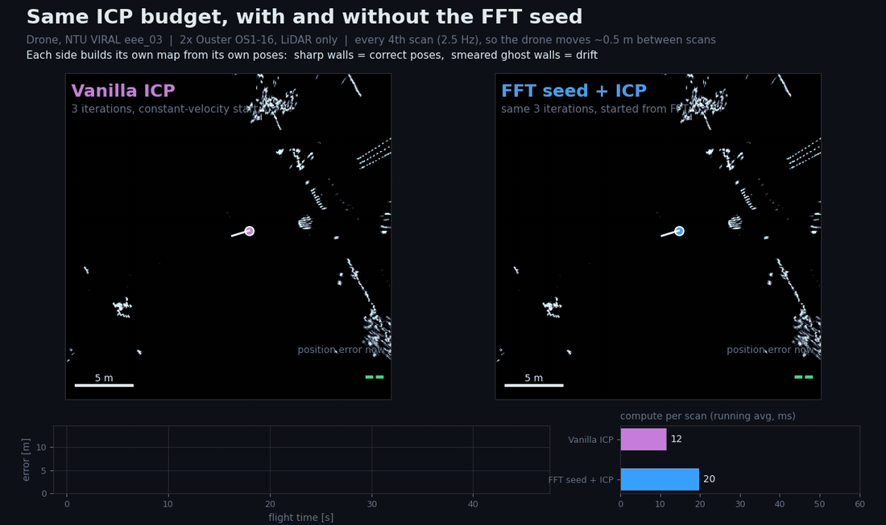
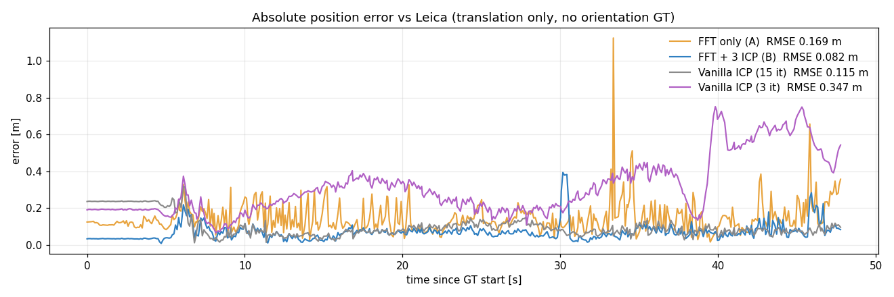
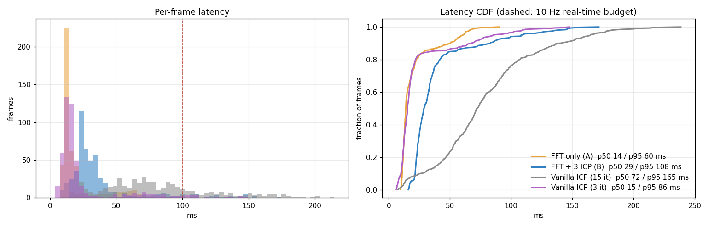

# fft-slice-odometry (WIP)

> **Work in progress.** Results cover only the first 48 s of ground truth of one sequence (partial download). Nothing here is tuned or final.

LiDAR odometry for a drone with two LiDARs. Each scan is cut into 2D slices, and FFT phase correlation registers each slice against a local map. That estimate seeds a short point-to-plane ICP. The comparison is against vanilla ICP only.



*Each side builds its own map from its own poses. Sharp walls mean correct poses; smeared walls mean drift. Every 4th scan is used (2.5 Hz), so the drone moves about 0.5 m between scans.*

## How it works

```
merged scan (2x OS1-16, body frame)
        |
        |  constant-velocity prediction
        v
+---------------------------------------------------------------+
| latitude slices   : 3 z-bands  -> XY images                   |
|                     Fourier-Mellin (log-polar |FFT|) -> yaw    |
|                     phase correlation            -> x, y       |
| longitudinal slices: 5 y-bands -> XZ,  5 x-bands -> YZ         |
|                     per-band phase correlation -> dz_k         |
|                     line fit dz_k vs band lever arm            |
|                        slope -> roll / pitch, intercept -> z   |
+---------------------------------------------------------------+
        |  coarse pose (peak search bounded to +-8 m, +-20 deg)
        v
3 point-to-plane ICP iterations vs local map  ->  pose
```

Design details:

- **Map spectra are cached per keyframe.** Each frame only rasterizes and transforms the scan.
- **The Gaussian blur is gone.** It would cancel in normalized phase correlation anyway, and it survives only as a spectral weight in the Fourier-Mellin step.
- **Real FFTs (`rfft2`).** The ky >= 0 half-plane is exactly the [0, pi) angle range that rotation needs.
- **Roll and pitch come from the band line fit.** Fourier-Mellin on the side views could not resolve sub-degree tilt.
- **Bounded peak searches.** Rectilinear buildings alias under 90 deg rotations, so an unbounded search sometimes flipped yaw.

## Results (NTU VIRAL eee_03, first 48 s of Leica ground truth)

ATE is translation only, after rigid (Umeyama) alignment; the ground truth has no orientation. Latency is measured over the same frames, on one laptop CPU, in pure numpy/scipy.

**10 Hz (every scan)**

| Method | ATE RMSE | p50 ms | p95 ms |
|---|---|---|---|
| FFT seed + 3 ICP iterations | **0.082 m** | 29 | 108 |
| Vanilla ICP, 3 iterations | 0.347 m | 15 | 86 |
| Vanilla ICP, 15 iterations | 0.115 m | 72 | 165 |
| FFT only (no ICP) | 0.169 m | 14 | 60 |

**2.5 Hz (every 4th scan, larger motion between scans)**

| Method | ATE RMSE | p50 ms | p95 ms |
|---|---|---|---|
| FFT seed + 3 ICP iterations | **0.130 m** | 30 | 111 |
| Vanilla ICP, 3 iterations | 2.976 m (lost track) | 15 | 120 |
| Vanilla ICP, 15 iterations | 2.546 m (lost track) | 78 | 217 |
| FFT only (no ICP) | 0.188 m | 13 | 51 |

What the numbers support:

- **The FFT seed makes 3 ICP iterations enough.** At the same ICP budget it cuts error about 4x at 10 Hz, for about 13 ms per frame.
- **It survives motion that loses vanilla ICP.** At 2.5 Hz, both vanilla ICP variants lose track.
- **B vs 15-iteration ICP at 10 Hz (0.082 vs 0.115 m) is within run-to-run sensitivity.** Swapping the normal estimator alone moved vanilla ICP from 0.95 m to 0.115 m.
- **B's p95 is just over the 100 ms budget of a 10 Hz sensor.** The spikes come from keyframe map updates.




## Run

```bash
python -m venv --system-site-packages .venv && .venv/bin/pip install -r requirements.txt
.venv/bin/python extract.py eee_03.zip data            # streams the bag out of the zip, works on truncated downloads
.venv/bin/python odom.py data/frames.npz results        # modes: fft, fft_icp, icp, icp3
.venv/bin/python evaluate.py results data/gt_prism.tum  # metrics.json + plots
.venv/bin/python gif_race.py data/frames.npz results data/gt_prism.tum race.gif
.venv/bin/python render.py data/frames.npz results data/gt_prism.tum full.mp4
```

Checks: `fftreg.py` (known rotation and shift must be recovered), `sim_test.py [stride]` (synthetic flight, plus a deliberately broken sign that must fail), `diag_fft.py` (per-axis FFT residual).

## Data

Uses [NTU VIRAL](https://ntu-aris.github.io/ntu_viral_dataset/); no dataset files are included in this repo. LiDAR extrinsics are from [SLICT's ntuviral.yaml](https://github.com/brytsknguyen/SLICT), and the prism offset is from the NTU VIRAL evaluation tutorial.

## TODO

- Run on the full eee_03 and the other sequences.
- Move keyframe map updates off the critical path to bring p95 under 100 ms.
- Deskew using the per-point Ouster timestamps.
